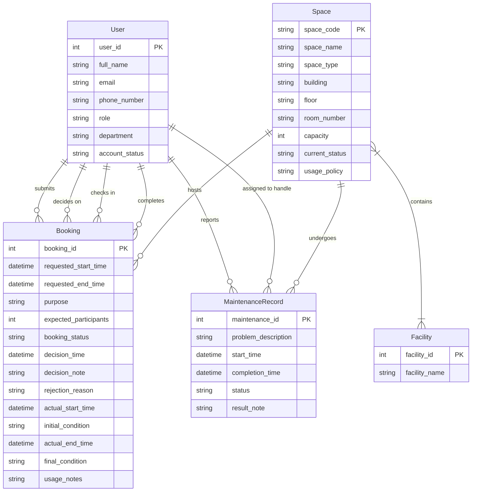

# Conceptual Database Design (ERD) — Group 09

## 1. Conceptual Entity-Relationship Diagram

*Copy the code below and paste it into a live editor like [Mermaid Live](https://mermaid.live/) to view the diagram.*

---

## 2. Conceptual Data Dictionary

### Entities and Attributes

* **User** — a person with a university account who interacts with the system in one or more roles (student, lecturer, teaching assistant, facility staff, department administrator, facility manager).
  * `user_id` (PK) — int
  * `full_name` — string
  * `email` — string
  * `phone_number` — string
  * `role` — string
  * `department` — string
  * `account_status` — string

* **Space** — a bookable physical room or area managed by the School (e.g., classroom, computer lab, auditorium).
  * `space_code` (PK) — string
  * `space_name` — string
  * `space_type` — string
  * `building` — string
  * `floor` — string
  * `room_number` — string
  * `capacity` — int
  * `current_status` — string
  * `usage_policy` — string

* **Facility** — a type of equipment or amenity available in spaces (e.g., projector, whiteboard, air conditioner).
  * `facility_id` (PK) — int
  * `facility_name` — string

* **Booking** — a transactional record capturing a user's request to reserve a space for a specific time, purpose, and participant count. Tracks the full lifecycle from submission through approval/rejection, check-in, and session completion.
  * `booking_id` (PK) — int
  * `requested_start_time` — datetime
  * `requested_end_time` — datetime
  * `purpose` — string
  * `expected_participants` — int
  * `booking_status` — string
  * `decision_time` — datetime
  * `decision_note` — string
  * `rejection_reason` — string
  * `actual_start_time` — datetime
  * `initial_condition` — string
  * `actual_end_time` — datetime
  * `final_condition` — string
  * `usage_notes` — string

* **MaintenanceRecord** — a transactional record of a reported problem affecting a space, tracking the issue from report through assignment to resolution.
  * `maintenance_id` (PK) — int
  * `problem_description` — string
  * `start_time` — datetime
  * `completion_time` — datetime
  * `status` — string
  * `result_note` — string

### Relationship Summary

| Relationship | Cardinality | Participation | Description |
|---|---|---|---|
| User **submits** Booking | 1 : N | Booking mandatory, User optional | A user acts as the requester for a booking. Every booking must have exactly one requester. A user may submit zero or more bookings. |
| User **decides on** Booking | 1 : N | Both optional | A facility staff member or facility manager approves or rejects a booking. A booking may have zero or one decision (if still pending). A staff member may never make a decision. |
| User **checks in** Booking | 1 : N | Booking optional, User optional | Facility staff records the actual start of a session. A booking may never be checked in (e.g., cancelled, no-show). A staff member may perform zero or more check-ins. |
| User **completes** Booking | 1 : N | Booking optional, User optional | Facility staff records the actual end of a session. A booking may never reach completion. A staff member may perform zero or more completions. |
| Space **hosts** Booking | 1 : N | Booking mandatory, Space optional | Each booking reserves exactly one space. A space may host zero or more bookings over time. |
| Space **contains** Facility | M : N | Both optional | A space may be equipped with zero or more types of facilities. A facility type may appear in zero or more spaces. |
| User **reports** MaintenanceRecord | 1 : N | MaintenanceRecord mandatory, User optional | A user reports a maintenance problem. Every maintenance record must have exactly one reporter. A user may report zero or more issues. |
| User **assigned to handle** MaintenanceRecord | 1 : N | Both optional | A staff member is assigned to resolve a maintenance issue. A record may remain unassigned initially. A staff member may have zero or more assignments. |
| Space **undergoes** MaintenanceRecord | 1 : N | MaintenanceRecord mandatory, Space optional | Each maintenance record concerns exactly one space. A space may undergo zero or more maintenance events over time. |

---

## Design Notes

1. **Space–Facility M:N preserved.** The Phase 1 analysis proposed a `SpaceFacility` associative entity to resolve the many-to-many relationship. Per conceptual design rules, M:N relationships must not be resolved into junction tables at this stage. The direct `Space }|--|{ Facility` line captures the real-world reality: a space has many facility types, and a facility type exists in many spaces.

2. **No Foreign Keys.** All FK attributes from the Phase 1 candidate lists (e.g., `requester_id`, `space_code` inside Booking; `reporter_id` inside MaintenanceRecord) have been removed. The relationship lines drawn between entities are the sole conceptual representation of these connections.

3. **Multiple User–Booking relationships.** The User entity plays four distinct roles with respect to Booking: *requester* (submits), *decision-maker* (decides on), *check-in staff* (checks in), and *completion staff* (completes). Each role is modelled as a separate relationship line because it represents a distinct business interaction involving possibly different users at different times.

4. **Mermaid parameterisation.** The Mermaid erDiagram syntax supports only three cardinality operators (`||--||`, `||--o{`, `}|--|{`). Finer participation constraints (mandatory vs. optional on each side) are documented in the relationship summary table above rather than in the diagram itself.
