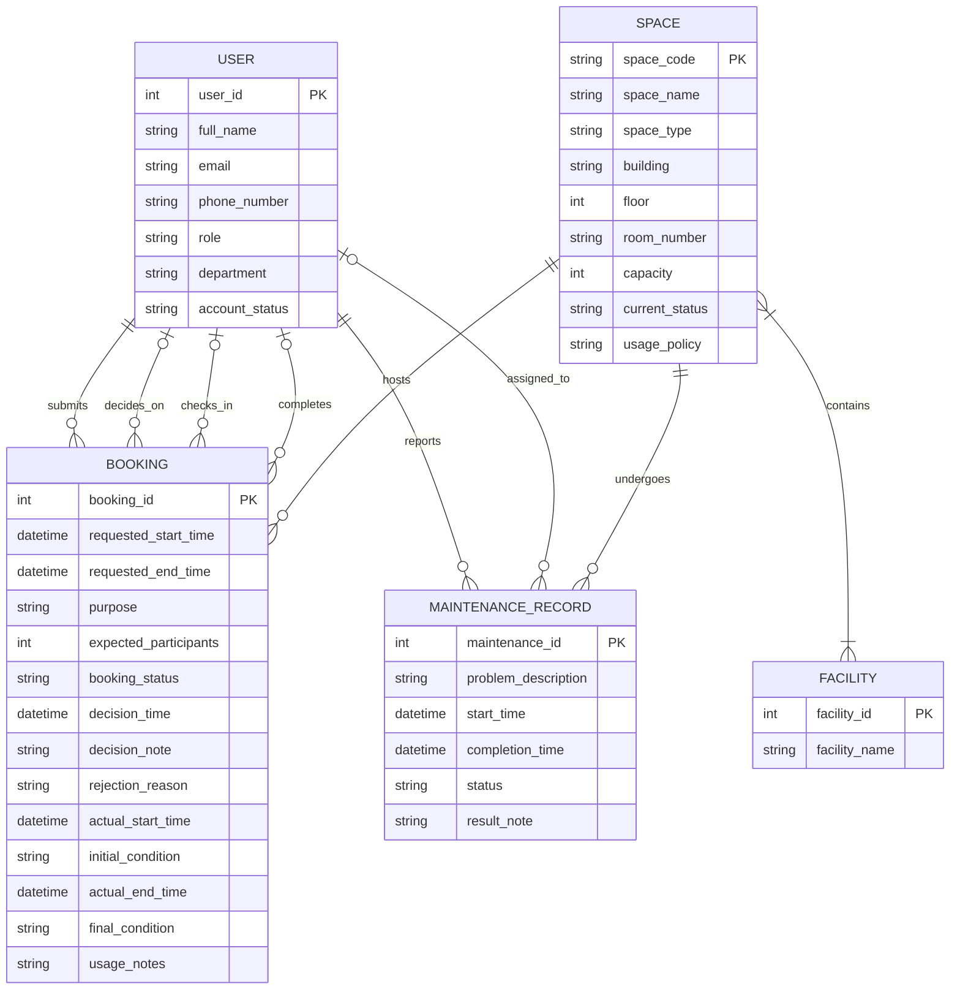

# Conceptual Database Design (ERD)

---

## 1. Conceptual Entity-Relationship Diagram

*Copy the code below and paste it into a live editor like [Mermaid Live](https://mermaid.live/) to view the diagram.*

---

## 2. Conceptual Data Dictionary

### Entities and Attributes

* **USER**
  * `user_id` (PK) — int
  * `full_name` — string
  * `email` — string
  * `phone_number` — string
  * `role` — string *(student / lecturer / teaching_assistant / facility_staff / department_administrator / facility_manager)*
  * `department` — string
  * `account_status` — string *(active / suspended / deactivated)*

* **SPACE**
  * `space_code` (PK) — string
  * `space_name` — string
  * `space_type` — string *(auditorium / classroom / computer_lab / project_lab / meeting_room / student_workspace)*
  * `building` — string
  * `floor` — int
  * `room_number` — string
  * `capacity` — int
  * `current_status` — string *(available / in_use / under_maintenance / temporarily_closed / retired)*
  * `usage_policy` — string

* **FACILITY**
  * `facility_id` (PK) — int
  * `facility_name` — string *(e.g., projector, whiteboard, microphone, computer, livestreaming_equipment, air_conditioner)*

* **BOOKING**
  * `booking_id` (PK) — int
  * `requested_start_time` — datetime
  * `requested_end_time` — datetime
  * `purpose` — string *(lecture / examination / seminar / workshop / meeting / student_activity / administrative_event)*
  * `expected_participants` — int
  * `booking_status` — string *(pending / approved / rejected / cancelled / checked_in / completed / no_show)*
  * `decision_time` — datetime
  * `decision_note` — string
  * `rejection_reason` — string
  * `actual_start_time` — datetime
  * `initial_condition` — string
  * `actual_end_time` — datetime
  * `final_condition` — string
  * `usage_notes` — string

* **MAINTENANCE_RECORD**
  * `maintenance_id` (PK) — int
  * `problem_description` — string
  * `start_time` — datetime
  * `completion_time` — datetime
  * `status` — string *(reported / in_progress / completed)*
  * `result_note` — string

### Relationship Summary

| Entity (Left) | Cardinality | Entity (Right) | Verb Phrase | Description |
|---|---|---|---|---|
| USER | 1 : N | BOOKING | submits | Each booking must be submitted by exactly one requester; each user may submit zero or many bookings. |
| USER | 1 : N | BOOKING | decides_on | Each booking may be approved/rejected by at most one staff member; each staff member may decide on zero or many bookings. Participation optional on both sides. |
| USER | 1 : N | BOOKING | checks_in | Each booking may be checked in by at most one staff member; each staff member may check in zero or many bookings. Participation optional on both sides. |
| USER | 1 : N | BOOKING | completes | Each booking may be completed by at most one staff member; each staff member may complete zero or many bookings. Participation optional on both sides. |
| SPACE | 1 : N | BOOKING | hosts | Each booking must reserve exactly one space; each space may host zero or many bookings over time. |
| USER | 1 : N | MAINTENANCE_RECORD | reports | Each maintenance record must have exactly one reporter; each user may report zero or many maintenance records. |
| USER | 1 : N | MAINTENANCE_RECORD | assigned_to | Each maintenance record may be assigned to at most one staff member; each staff member may be assigned zero or many records. Participation optional on both sides. |
| SPACE | 1 : N | MAINTENANCE_RECORD | undergoes | Each maintenance record must concern exactly one space; each space may undergo zero or many maintenance records. |
| SPACE | M : N | FACILITY | contains | Each space may contain many facility types; each facility type may be available in many spaces. |

---
