# Conceptual Database Design (ERD)

---

## 1. Conceptual Entity-Relationship Diagram

*Copy the code below and paste it into a live editor like [Mermaid Live](https://mermaid.live/) to view the diagram.*

```mermaid
erDiagram
    USER ||--o{ BOOKING : "submits"
    USER |o--o{ BOOKING : "decides_on"
    USER |o--o{ BOOKING : "checks_in"
    USER |o--o{ BOOKING : "completes"
    SPACE ||--o{ BOOKING : "hosts"
    USER ||--o{ MAINTENANCE_RECORD : "reports"
    USER |o--o{ MAINTENANCE_RECORD : "assigned_to"
    SPACE ||--o{ MAINTENANCE_RECORD : "undergoes"
    SPACE }|--|{ FACILITY : "contains"

    USER {
        int user_id PK
        string full_name
        string email
        string phone_number
        string role
        string department
        string account_status
    }

    SPACE {
        string space_code PK
        string space_name
        string space_type
        string building
        int floor
        string room_number
        int capacity
        string current_status
        string usage_policy
    }

    FACILITY {
        int facility_id PK
        string facility_name
    }

    BOOKING {
        int booking_id PK
        datetime requested_start_time
        datetime requested_end_time
        string purpose
        int expected_participants
        string booking_status
        datetime decision_time
        string decision_note
        string rejection_reason
        datetime actual_start_time
        string initial_condition
        datetime actual_end_time
        string final_condition
        string usage_notes
    }

    MAINTENANCE_RECORD {
        int maintenance_id PK
        string problem_description
        datetime start_time
        datetime completion_time
        string status
        string result_note
    }
```

---

## 2. Conceptual Data Dictionary

### Entities and Attributes

* **USER**
  * `user_id` (PK) — int
  * `full_name` — string
  * `email` — string
  * `phone_number` — string
  * `role` — string *(student / lecturer / teaching_assistant / facility_staff / department_administrator / facility_manager)*
  * `department` — string
  * `account_status` — string *(active / suspended / deactivated)*

* **SPACE**
  * `space_code` (PK) — string
  * `space_name` — string
  * `space_type` — string *(auditorium / classroom / computer_lab / project_lab / meeting_room / student_workspace)*
  * `building` — string
  * `floor` — int
  * `room_number` — string
  * `capacity` — int
  * `current_status` — string *(available / in_use / under_maintenance / temporarily_closed / retired)*
  * `usage_policy` — string

* **FACILITY**
  * `facility_id` (PK) — int
  * `facility_name` — string

* **BOOKING**
  * `booking_id` (PK) — int
  * `requested_start_time` — datetime
  * `requested_end_time` — datetime
  * `purpose` — string *(lecture / examination / seminar / workshop / meeting / student_activity / administrative_event)*
  * `expected_participants` — int
  * `booking_status` — string *(pending / approved / rejected / cancelled / checked_in / completed / no_show)*
  * `decision_time` — datetime
  * `decision_note` — string
  * `rejection_reason` — string
  * `actual_start_time` — datetime
  * `initial_condition` — string
  * `actual_end_time` — datetime
  * `final_condition` — string
  * `usage_notes` — string

* **MAINTENANCE_RECORD**
  * `maintenance_id` (PK) — int
  * `problem_description` — string
  * `start_time` — datetime
  * `completion_time` — datetime
  * `status` — string *(reported / in_progress / completed)*
  * `result_note` — string

### Relationship Summary

| Entity (Left) | Cardinality | Entity (Right) | Verb Phrase | Description |
|---|---|---|---|---|
| USER | 1 : N | BOOKING | submits | Each booking must be submitted by exactly one requester; each user may submit zero or many bookings. |
| USER | 1 : N | BOOKING | decides_on | Each booking may be decided on by at most one staff member; each staff member may decide on zero or many bookings. (Optional both sides.) |
| USER | 1 : N | BOOKING | checks_in | Each booking may be checked in by at most one staff member; each staff member may check in zero or many bookings. (Optional both sides.) |
| USER | 1 : N | BOOKING | completes | Each booking may be completed by at most one staff member; each staff member may complete zero or many bookings. (Optional both sides.) |
| SPACE | 1 : N | BOOKING | hosts | Each booking must reserve exactly one space; each space may host zero or many bookings over time. |
| USER | 1 : N | MAINTENANCE_RECORD | reports | Each maintenance record must have exactly one reporter; each user may report zero or many records. |
| USER | 1 : N | MAINTENANCE_RECORD | assigned_to | Each maintenance record may be assigned to at most one staff member; each staff member may be assigned zero or many records. (Optional both sides.) |
| SPACE | 1 : N | MAINTENANCE_RECORD | undergoes | Each maintenance record must concern exactly one space; each space may undergo zero or many maintenance records. |
| SPACE | M : N | FACILITY | contains | Each space may contain many facility types; each facility type may exist in many spaces. |

---

## 3. Design Notes

1. **Foreign Keys Removed.** The Phase 1 candidate attribute lists included reference IDs such as `requester_id`, `space_code`, `decision_staff_id`, `check_in_staff_id`, `reporter_id`, and `assigned_staff_id` inside BOOKING and MAINTENANCE_RECORD. In this conceptual ERD, all such foreign keys have been deliberately excluded. The connections they represent are instead captured by the relationship lines drawn between entities, keeping the design free of relational database artifacts.

2. **M:N Relationship Preserved Without a Junction Entity.** The Phase 1 analysis modeled the Space–Facility association through the associative entity `SpaceFacility` (with a composite PK of `space_code` and `facility_id`). Since `SpaceFacility` carries no attributes of its own and exists solely to bridge two entities, it has been removed here. In its place, a direct many-to-many relationship `SPACE }|--|{ FACILITY : "contains"` is drawn. This aligns with the conceptual rule that pure M:N mappings are resolved only during logical schema design (Step 3), not during conceptual modeling.

3. **Multi-Role USER–BOOKING Relationships Clarified.** The USER entity participates in four distinct relationships with BOOKING — as *requester* (submits), *approver/rejecter* (decides_on), *check-in staff* (checks_in), and *completion staff* (completes). Each relationship is drawn as a separate line with its own verb phrase and independent cardinality. This reflects the business reality that different staff members may perform different actions on the same booking, and a single user may hold multiple roles.

4. **Relationship Verbs Refined from Step 1.** Several verb phrases were adjusted for brevity and visual clarity. The Phase 1 phrase "Booking reserves Space" became `SPACE ||--o{ BOOKING : "hosts"` to place the independent entity (SPACE) on the left. Similarly, "Staff decides on Booking" became `USER |o--o{ BOOKING : "decides_on"` (active voice), "Staff checks in Booking" became `checks_in`, "Staff completes Booking" became `completes`, "MaintenanceRecord concerns Space" became `SPACE ||--o{ MAINTENANCE_RECORD : "undergoes"`, and "Facility referenced by SpaceFacility" was consolidated into the direct `SPACE }|--|{ FACILITY : "contains"` relationship. All refinements preserve the original business meaning.

5. **Conceptual Data Types Used.** All attributes use abstract type names (`string`, `int`, `datetime`) rather than DBMS-specific types (`VARCHAR(255)`, `INTEGER`), maintaining independence from any particular relational database implementation.

