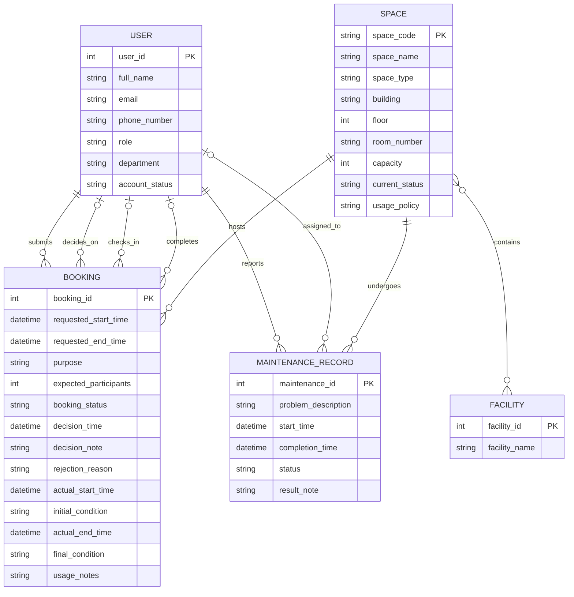

# Conceptual Database Design (ERD)

---

## 1. Conceptual Entity-Relationship Diagram

*Copy the code below and paste it into a live editor like [Mermaid Live](https://mermaid.live/) to view the diagram.*

---

## 2. Conceptual Data Dictionary

### Entities and Attributes

* **USER**
  * `user_id` (PK) — int
  * `full_name` — string
  * `email` — string
  * `phone_number` — string
  * `role` — string *(student / lecturer / teaching_assistant / facility_staff / department_administrator / facility_manager)*
  * `department` — string
  * `account_status` — string *(active / suspended / deactivated)*

* **SPACE**
  * `space_code` (PK) — string
  * `space_name` — string
  * `space_type` — string *(auditorium / classroom / computer_lab / project_lab / meeting_room / student_workspace)*
  * `building` — string
  * `floor` — int
  * `room_number` — string
  * `capacity` — int
  * `current_status` — string *(available / in_use / under_maintenance / temporarily_closed / retired)*
  * `usage_policy` — string

* **FACILITY**
  * `facility_id` (PK) — int
  * `facility_name` — string

* **BOOKING**
  * `booking_id` (PK) — int
  * `requested_start_time` — datetime
  * `requested_end_time` — datetime
  * `purpose` — string *(lecture / examination / seminar / workshop / meeting / student_activity / administrative_event)*
  * `expected_participants` — int
  * `booking_status` — string *(pending / approved / rejected / cancelled / checked_in / completed / no_show)*
  * `decision_time` — datetime
  * `decision_note` — string
  * `rejection_reason` — string
  * `actual_start_time` — datetime
  * `initial_condition` — string
  * `actual_end_time` — datetime
  * `final_condition` — string
  * `usage_notes` — string

* **MAINTENANCE_RECORD**
  * `maintenance_id` (PK) — int
  * `problem_description` — string
  * `start_time` — datetime
  * `completion_time` — datetime
  * `status` — string *(reported / in_progress / completed)*
  * `result_note` — string

### Relationship Summary

| Entity (Left) | Cardinality | Entity (Right) | Verb Phrase | Participation | Description |
|---|---|---|---|---|---|
| USER | 1 : N | BOOKING | submits | User optional; Booking mandatory | Each booking must be submitted by exactly one requester; each user may submit zero or many bookings. |
| USER | 1 : N | BOOKING | decides_on | User optional; Booking optional | Each booking may be decided on by at most one staff member; each staff member may decide on zero or many bookings. |
| USER | 1 : N | BOOKING | checks_in | User optional; Booking optional | Each booking may be checked in by at most one staff member; each staff member may check in zero or many bookings. |
| USER | 1 : N | BOOKING | completes | User optional; Booking optional | Each booking may be completed by at most one staff member; each staff member may complete zero or many bookings. |
| SPACE | 1 : N | BOOKING | hosts | Space optional; Booking mandatory | Each booking must reserve exactly one space; each space may host zero or many bookings over time. |
| USER | 1 : N | MAINTENANCE_RECORD | reports | User optional; MR mandatory | Each maintenance record must have exactly one reporter; each user may report zero or many records. |
| USER | 1 : N | MAINTENANCE_RECORD | assigned_to | User optional; MR optional | Each maintenance record may be assigned to at most one staff member; each staff member may be assigned zero or many records. |
| SPACE | 1 : N | MAINTENANCE_RECORD | undergoes | Space optional; MR mandatory | Each maintenance record must concern exactly one space; each space may undergo zero or many maintenance records. |
| SPACE | M : N | FACILITY | contains | Space optional; Facility optional | Each space may contain many facility types; each facility type may exist in many spaces. |

---

## 3. Design Notes

1. **Foreign Keys Removed.** The Phase 1 candidate attribute lists included six foreign keys: `requester_id`, `space_code`, `decision_staff_id`, and `check_in_staff_id` inside BOOKING; `space_code`, `reporter_id`, and `assigned_staff_id` inside MAINTENANCE_RECORD. In this conceptual ERD, all such foreign keys are deliberately excluded. The connections they represent are conveyed entirely by the relationship lines drawn between entities, preserving conceptual independence from relational implementation.

2. **M:N Relationship Preserved Without a Junction Entity.** The Phase 1 analysis modeled the Space–Facility association through the associative entity `SpaceFacility` (composite PK of `space_code` and `facility_id`). Since `SpaceFacility` carried no attributes beyond the two foreign keys and existed solely to resolve a many-to-many mapping, it has been removed here. A direct many-to-many relationship `SPACE }o--o{ FACILITY : "contains"` is drawn instead, using `}o--o{` to capture optional participation on both sides (a space may have zero recorded facilities; a facility type may exist in no spaces). This M:N relationship will be resolved into a junction table during Step 3 (Logical Schema Design).

3. **Multi-Role USER–BOOKING Relationships.** The USER entity participates in four separate relationships with BOOKING — as *requester* (submits), *approver/rejecter* (decides_on), *check-in staff* (checks_in), and *completion staff* (completes). Each is drawn as an independent relationship line with its own verb phrase and cardinality. This reflects the business reality that different staff members may perform different actions on the same booking, and a single user may hold multiple roles simultaneously (per the Step 1 assumption).

4. **Relationship Verbs Refined from Step 1.** Several verb phrases were adjusted to follow the left-to-right readability rule (parent entity on the left) and to use active, descriptive language:
   - "Booking reserves Space" → `SPACE ||--o{ BOOKING : "hosts"` (SPACE as independent parent on the left).
   - "MaintenanceRecord concerns Space" → `SPACE ||--o{ MAINTENANCE_RECORD : "undergoes"`.
   - "Facility referenced by SpaceFacility" was consolidated into `SPACE }o--o{ FACILITY : "contains"` after removing the SpaceFacility entity.
   - "Staff decides on Booking" → `decides_on`, "Staff checks in Booking" → `checks_in`, "Staff completes Booking" → `completes` (active voice, underscored for Mermaid compatibility).
   All refinements preserve the original business meaning from the requirements.

5. **Conceptual Data Types.** All attributes use platform-independent type names (`string`, `int`, `datetime`) rather than DBMS-specific notations such as `VARCHAR(255)` or `INTEGER`. This ensures the conceptual design remains vendor-neutral before entering the logical design phase.

6. **Entity Name and Attribute Formatting.** Entity names use UPPER_SNAKE_CASE (e.g., `MAINTENANCE_RECORD`); attribute names use snake_case (e.g., `requested_start_time`). No spaces appear in any identifier within the Mermaid block, as required for valid syntax.
